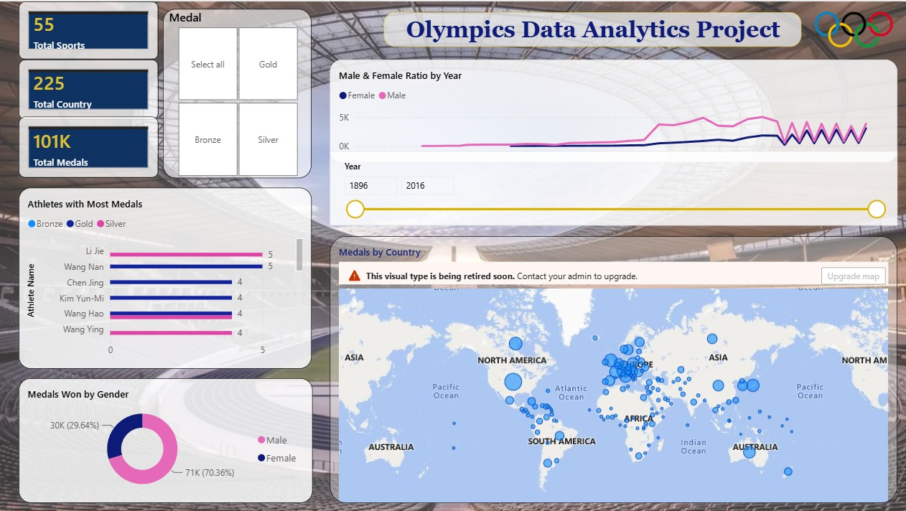

# 🏅 Olympics Data Analytics Project

An interactive Power BI dashboard analyzing Olympic Games data from **1896 to 2016**, covering athletes, countries, sports, and medals.

<!-- Save the dashboard screenshot as images/dashboard.png in your repo -->

## 📊 Key Metrics

| Metric | Value |
|---|---|
| Total Sports | 55 |
| Total Countries | 225 |
| Total Medals | 101K |
| Medals won by Male athletes | 71K (70.36%) |
| Medals won by Female athletes | 30K (29.64%) |

## 🔍 Dashboard Features

- **KPI cards**: total sports, countries, and medals at a glance
- **Medal slicer**: filter by Gold, Silver, Bronze, or all
- **Year slider**: explore any range between 1896 and 2016
- **Male & Female ratio by year**: participation trend over time
- **Athletes with most medals**: top performers, split by medal type
- **Medals won by gender**: donut chart of the male/female split
- **Medals by country**: bubble map showing the global medal distribution

## 🛠️ Tools Used

- Power BI Desktop
- DAX (measures and calculated columns)
- Power Query (data cleaning and transformation)

## 📁 Repository Structure
